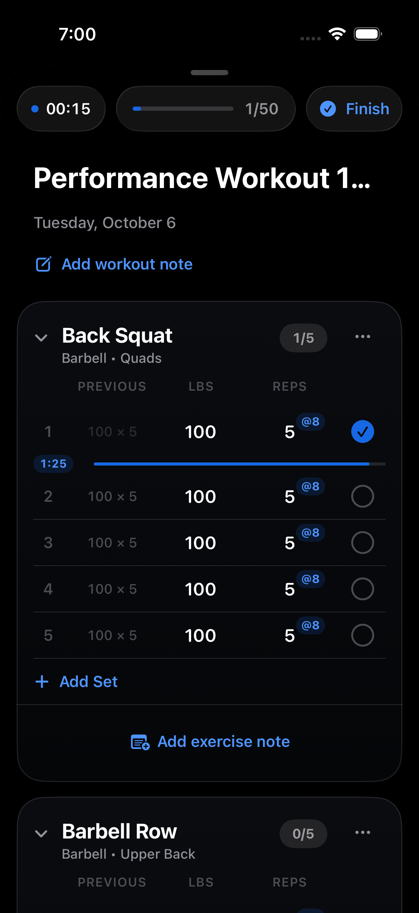

# Issue 114 validation

Validated on 2026-10-06, Debug, iPhone 17 Simulator (iOS 26.4.1), using the 10-exercise × 5-set Active Workout fixture. Production implementation uses the chosen B3 design as reference; no prototype code or variant switcher was promoted.

## Automated checks

- Full `BarosTests`: **866 passed**. Includes 13 rest tests covering completion/RPE, save failure/retry, replacement, editing, cancellation, adjustment floor, skip, expiry, local persistence/relaunch, initial owner recovery, confirmed sign-out, sync-applied removal/uncompletion, current-owner duration lookup, notification scheduling/removal, and VoiceOver auto-open policy.
- `testCompletingSetStartsRestAndSkipRemovesIt`: passed.
- `testRestBadgeControlsAndCollapsedHeaderFallback`: passed. Tapped the badge, both adjustment buttons, collapsed the exercise, opened header controls, and skipped.
- `testRestControlsAtAccessibilityTextSizeAndFocusDuringRest`: passed with accessibility3 and the Debug Reduce Motion policy hook. The controls remained hittable, focusing a weight field closed the controls, and typing continued during rest.
- `testRestOverNotificationWhenAppIsBackgrounded`: passed using the real `UNUserNotificationCenter` adapter and a 30-second Settings fixture. The first authorization request was accepted, the app was backgrounded, SpringBoard exposed “Rest over” at expiry, and returning to the workout did not replay rest.
- `git diff --check`: passed.
- Standards and Spec reviews: no remaining code findings after lifecycle fixes.

The UI tests retain screenshots in their Xcode result bundles. The notification banner can dismiss before screenshot capture; the delivery assertion uses its SpringBoard accessibility element.

## Performance

Temporary `Self._printChanges()` probes were placed in `ExerciseCardView`, `SetRowView`, and `WorkoutHeaderView`, then removed. After the fixture settled, a temporary harness started rest, adjusted it, skipped, restarted, and replaced it with a set in another card. No probe output appeared between those action markers. Thus timer-only changes did not evaluate those ancestor bodies. The existing elapsed-workout tick was also moved into a header leaf.

`ps` sampled app CPU once per second for 10-second windows. The no-rest run averaged **2.48%**, and the steady countdown window averaged **1.59%**. These are coarse simulator measurements from separate runs, not an Instruments energy benchmark; they show no material CPU increase during rest. The time and bar use scoped 1-second `TimelineView`s, and the bar uses a horizontal rendering scale. No `timerInterval` views were added.

## Remaining pre-merge check

Kevin must confirm typing/focus navigation and scrolling during rest on a physical device. Simulator interaction, injected-clock tests, and the VoiceOver policy test do not establish physical-device feel or a complete spoken VoiceOver audit. Confirm haptic/sound and locked-device delivery while doing that device pass.
